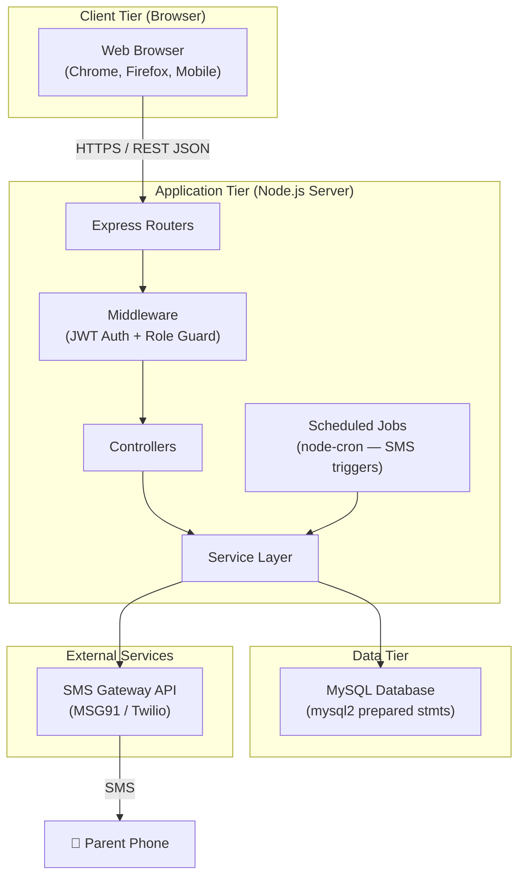
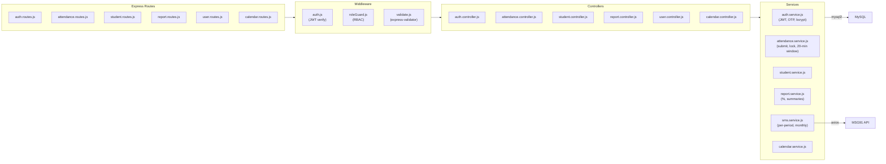
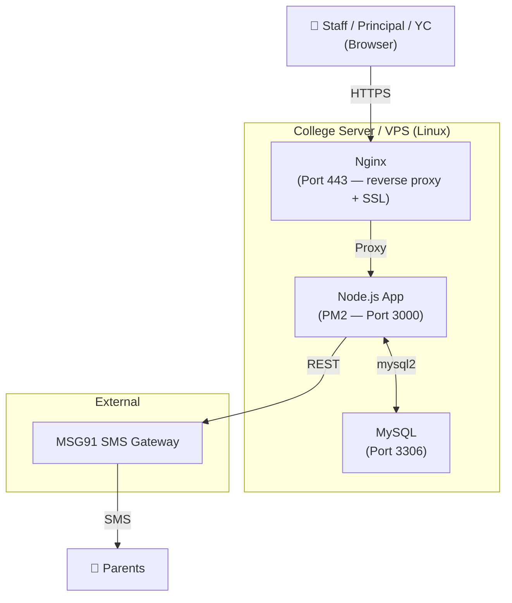
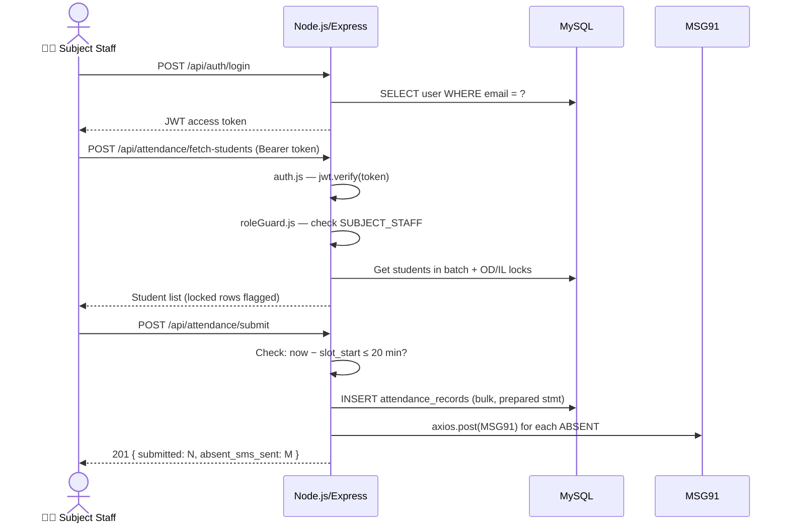

# Architecture Design
**Project**: Donbosco Attendance System | **Version**: 3.0 (Node.js) | **Date**: 2026-03-05

> Updated v3.0: Migrated from Spring Boot to Node.js + Express.js backend. Removed subject-staff mapping.

---

## 1. Architecture Overview

---

## 2. Technology Stack

| Layer | Technology |
|---|---|
| **Frontend** | HTML + Vanilla JS + CSS (served separately) |
| **Runtime** | Node.js v20 LTS |
| **Framework** | Express.js v5 |
| **Auth / Security** | JWT (`jsonwebtoken`) + `bcryptjs` + `helmet` |
| **Database Driver** | `mysql2` (promise-based, prepared statements) |
| **Database** | MySQL 8 |
| **Validation** | `express-validator` |
| **SMS** | MSG91 REST API via `axios` |
| **Scheduler** | `node-cron` |
| **Process Manager** | PM2 (production) / nodemon (dev) |
| **Deployment** | Linux VPS or on-premise (Nginx + PM2) |

---

## 3. Component Architecture

> **No ORM**: Raw SQL via `mysql2` prepared statements. No subject-staff mapping.

---

## 4. Security Architecture

| Role | Access Scope |
|---|---|
| `PRINCIPAL` | All pages — dashboard, add staff/subject, holiday, correction, view, audit |
| `YEAR_COORDINATOR` | Own year — dashboard, add student, OD/IL, attendance view, reports |
| `SUBJECT_STAFF` | Attendance page only — select any year/batch/period, submit |

- **Authentication**: Username + password (bcrypt). Session-based.
- **Password Reset**: OTP via SMS. Self-service.
- **Server-enforced**: 20-min window, holiday lock, role access.

---

## 5. Scheduled Jobs

| Job | Schedule | Description |
|---|---|---|
| `MonthlyWarningJob` | Last day of month, 11:00 PM | Check cumulative %. Send SMS if < 80% |

---

## 6. Deployment Diagram

---

## 7. Data Flow: Staff Takes Attendance

## Links
- [[attendance Donbosco]]
- [[BRS]]
- [[Backend Architecture]]
- [[Backend Development Workflow]]
- [[API Reference]]
