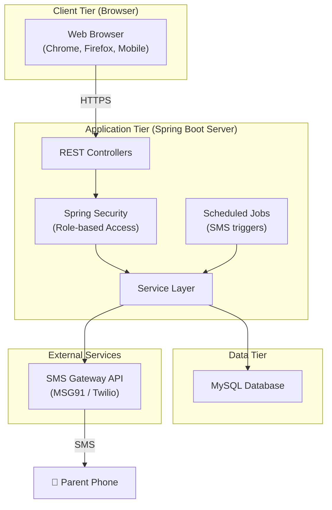
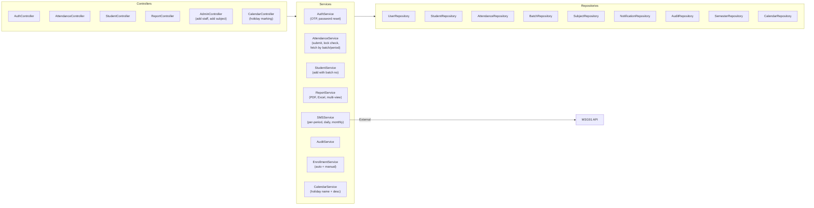
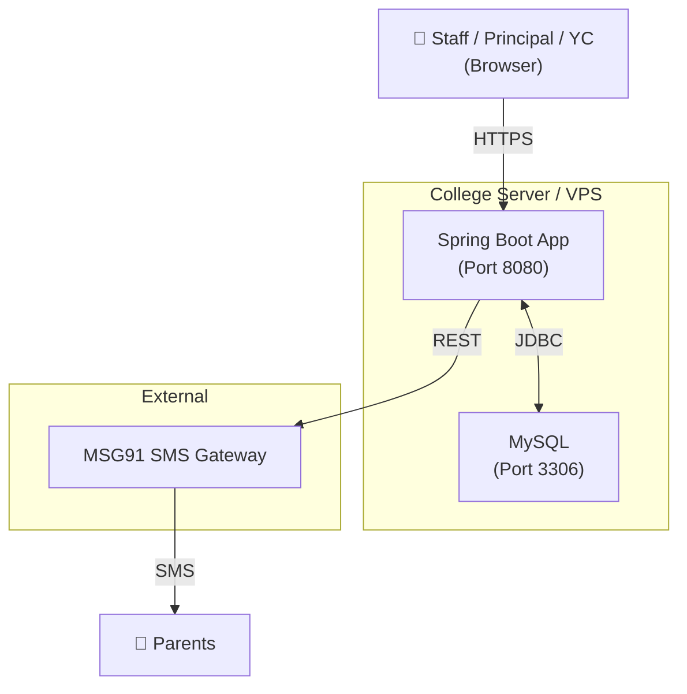
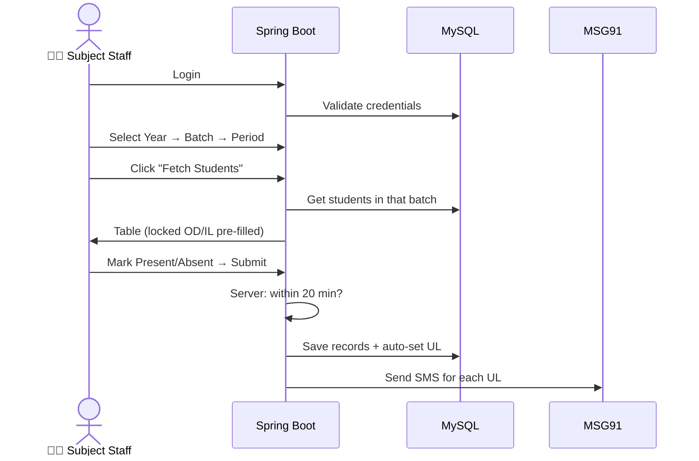

# Architecture Design
**Project**: Donbosco Attendance System | **Version**: 2.0 (Updated) | **Date**: 2026-03-03

> Updated: removed subject-staff mapping from all components and services.

---

## 1. Architecture Overview

---

## 2. Technology Stack

| Layer | Technology |
|---|---|
| **Frontend** | Thymeleaf (server-rendered) + Bootstrap 5 |
| **Backend** | Java 17 + Spring Boot 3 |
| **Security** | Spring Security (session-based + role RBAC) |
| **ORM** | Spring Data JPA + Hibernate |
| **Database** | MySQL 8 |
| **SMS** | MSG91 API (DLT compliant) |
| **Build** | Maven |
| **Server** | Embedded Tomcat |
| **Deployment** | Single server (Linux VPS or on-premise) |

---

## 3. Component Architecture

> **Removed**: `AssignmentService` and `AssignmentRepository` — no subject-staff mapping needed.

---

## 4. Security Architecture

| Role | Access Scope |
|---|---|
| `PRINCIPAL` | All pages — dashboard, add staff/subject, holiday, correction, view, audit |
| `YEAR_COORDINATOR` | Own year — dashboard, add student, OD/IL, attendance view, reports |
| `SUBJECT_STAFF` | Attendance page only — select any year/batch/period, submit |

- **Authentication**: Username + password (bcrypt). Session-based.
- **Password Reset**: OTP via SMS. Self-service.
- **Server-enforced**: 20-min window, holiday lock, role access.

---

## 5. Scheduled Jobs

| Job | Schedule | Description |
|---|---|---|
| `MonthlyWarningJob` | Last day of month, 11:00 PM | Check cumulative %. Send SMS if < 80% |

---

## 6. Deployment Diagram

---

## 7. Data Flow: Staff Takes Attendance

## Links
- [[attendance Donbosco]]
- [[BRS]]
