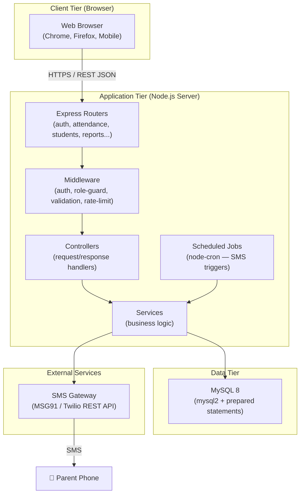
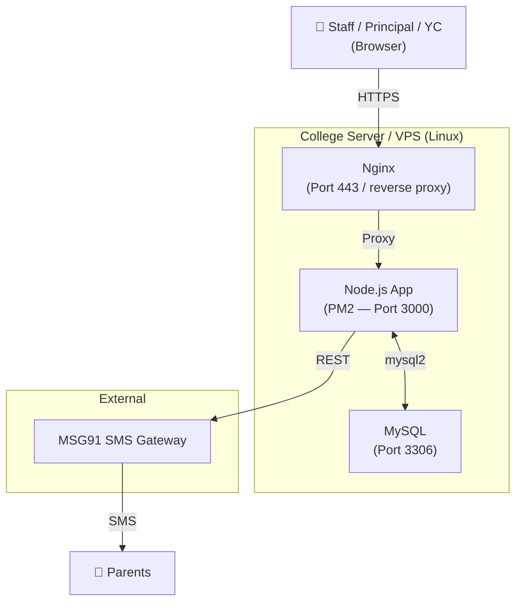

# Backend Architecture
**Project**: Donbosco Attendance System | **Version**: 1.1 | **Date**: 2026-03-06
**Stack**: Node.js + Express.js + MySQL

---

## 1. Architecture Overview



---

## 2. Technology Stack

| Layer | Technology |
|---|---|
| **Runtime** | Node.js (v20 LTS) |
| **Framework** | Express.js v5 |
| **Database Driver** | `mysql2` (promise-based, prepared statements) |
| **Auth** | JWT (`jsonwebtoken`) — stateless |
| **Password Hashing** | `bcryptjs` |
| **Input Validation** | `express-validator` |
| **Scheduled Jobs** | `node-cron` |
| **SMS** | MSG91 REST API (via `axios`) |
| **Environment Config** | `dotenv` |
| **Logging** | `morgan` (HTTP) + `winston` (app logs) |
| **Security** | `helmet`, `cors`, `express-rate-limit` |
| **Build / Dev** | `nodemon` (dev), `pm2` (production) |
| **Database** | MySQL 8 |
| **Deployment** | Linux VPS or on-premise server |

---

## 3. Folder Structure

```
donbosco-backend/
├── src/
│   ├── config/
│   │   ├── db.js              # MySQL pool + connection
│   │   └── env.js             # Validated environment variables
│   ├── middleware/
│   │   ├── auth.js            # JWT verify → req.user
│   │   ├── roleGuard.js       # Role-based access (Principal/YC/Staff)
│   │   ├── validate.j`s        # express-validator error handler
│   │   └── rateLimiter.js     # Login rate limiting
│   ├── routes/
│   │   ├── auth.routes.js
│   │   ├── user.routes.js
│   │   ├── student.routes.js
│   │   ├── batch.routes.js
│   │   ├── subject.routes.js
│   │   ├── semester.routes.js
│   │   ├── attendance.routes.js
│   │   ├── calendar.routes.js
│   │   ├── report.routes.js
│   │   └── audit.routes.js
│   ├── controllers/
│   │   ├── auth.controller.js
│   │   ├── user.controller.js
│   │   ├── student.controller.js
│   │   ├── batch.controller.js
│   │   ├── subject.controller.js
│   │   ├── semester.controller.js
│   │   ├── attendance.controller.js
│   │   ├── calendar.controller.js
│   │   ├── report.controller.js
│   │   └── audit.controller.js
│   ├── services/
│   │   ├── auth.service.js
│   │   ├── user.service.js
│   │   ├── student.service.js
│   │   ├── attendance.service.js
│   │   ├── report.service.js
│   │   ├── sms.service.js
│   │   └── calendar.service.js
│   ├── jobs/
│   │   └── monthlyWarning.job.js   # node-cron: end-of-month SMS
│   ├── utils/
│   │   ├── logger.js               # winston logger
│   │   └── apiResponse.js          # Standard JSON response helpers
│   └── app.js                      # Express app setup
├── server.js                        # HTTP server entry point
├── .env                             # Environment variables
├── .env.example
├── package.json
└── README.md
```

---

## 4. Request–Response Flow

```mermaid

```

---

## 5. Authentication Flow

```mermaid
sequenceDiagram
    actor U as User
    participant A as Auth Route
    participant DB as MySQL

    U->>A: POST /api/auth/login { email, password }
    A->>DB: SELECT user WHERE email = ?
    A->>A: bcrypt.compare(password, hash)
    A-->>U: 200 { token: "JWT..." } (15min access + 7d refresh)

    Note over U,A: Every protected request
    U->>A: GET /api/... Header: Authorization: Bearer <token>
    A->>A: auth middleware: jwt.verify(token)
    A-->>U: 200 data OR 401 Unauthorized
```

- **Access Token**: 15 minutes (JWT)
- **Refresh Token**: 7 days (stored in HttpOnly cookie)
- **Password reset**: OTP via SMS → set new password

---

## 6. Role-Based Access Control

| Role | Allowed Routes |
|---|---|
| `PRINCIPAL` | All routes including `/users`, `/subjects`, `/calendar/holiday` (GET/POST/PUT/DELETE), `/attendance/correct`, `/audit` |
| `YEAR_COORDINATOR` | `/students` (full CRUD), `/batches`, `/subjects` (GET), `/attendance/od-il` (GET/POST/PUT/DELETE), `/attendance/view`, `/reports` (own year) |
| `SUBJECT_STAFF` | `/attendance/fetch-students` (GET), `/attendance/submit` (POST) |

Enforced by `roleGuard.js` middleware:
```js
// Example
router.post('/submit', auth, roleGuard(['SUBJECT_STAFF', 'PRINCIPAL']), controller.submit)
```

---

## 7. Scheduled Jobs

| Job | Schedule (cron) | Action |
|---|---|---|
| `monthlyWarningJob` | `0 23 L * *` (last day, 11 PM) | Query students with < 80% attendance, send SMS |

---

## 8. Error Handling Strategy

All errors follow a single JSON shape:
```json
{
  "success": false,
  "error": {
    "code": "WINDOW_EXPIRED",
    "message": "The 20-minute submission window has closed."
  }
}
```

- Validation errors → `400 Bad Request` (express-validator)
- Auth failures → `401 Unauthorized`
- Role violations → `403 Forbidden`
- Business rule failures → `422 Unprocessable Entity`
- Server errors → `500 Internal Server Error` (logged via winston)

---

## 9. Database Connection

Using `mysql2` connection pool with prepared statements:

```js
// src/config/db.js
import mysql from 'mysql2/promise';

const pool = mysql.createPool({
  host: process.env.DB_HOST,
  user: process.env.DB_USER,
  password: process.env.DB_PASS,
  database: process.env.DB_NAME,
  waitForConnections: true,
  connectionLimit: 10,
  queueLimit: 0
});

export default pool;
```

All SQL queries use **prepared statements**:
```js
const [rows] = await pool.execute('SELECT * FROM students WHERE batch_id = ?', [batchId]);
```

---

## 10. Deployment



**Production setup**:
- **PM2**: Process manager — auto-restart on crash, cluster mode
- **Nginx**: Reverse proxy + SSL termination
- **Environment**: `.env` file — never committed to git

---

## Links
- [[Architecture Design]]
- [[Database Design]]
- [[Backend Development Workflow]]
- [[API Reference]]
- [[System Design]]
