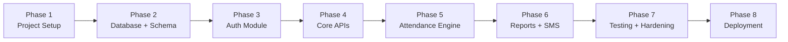

# Backend Development Workflow
**Project**: Donbosco Attendance System | **Version**: 2.0 | **Date**: 2026-03-07
**Tech**: Node.js + Express.js + MySQL + **Sequelize ORM**

---

## Overview

This workflow defines the **complete phased plan** for building the backend from scratch. Each phase has a clear goal, tasks, and success criteria.



---

## Phase 1 — Project Setup

**Goal**: Initialize the Node.js project with all dependencies and folder structure.

### Steps

```bash
# 1. Initialize project
mkdir donbosco-backend && cd donbosco-backend
npm init -y

# 2. Install production dependencies
npm install express sequelize mysql2 jsonwebtoken bcryptjs express-validator \
            dotenv cors helmet morgan winston node-cron axios

# 3. Install dev dependencies
npm install -D nodemon

# 4. Set type to module (ESM) in package.json
#    "type": "module"
```

> ℹ️ Note: `sequelize` is the ORM layer. `mysql2` is still required — Sequelize uses it under the hood as the MySQL dialect driver. Both packages must be installed.

### Files to Create
- `server.js` — HTTP server entry (`app.listen`)
- `src/app.js` — Express app, mount routers, global middleware
- `src/config/db.js` — Sequelize instance + sync
- `src/config/env.js` — Validate and export env vars
- `.env` — Environment variables (see below)
- `.env.example` — Template (committed to git)
- `.gitignore`

### .env Variables
```
PORT=3000
DB_HOST=localhost
DB_USER=root
DB_PASS=yourpassword
DB_NAME=donbosco_attendance
JWT_SECRET=super_secret_key_here
JWT_REFRESH_SECRET=another_secret
JWT_EXPIRY=15m
JWT_REFRESH_EXPIRY=7d
MSG91_AUTH_KEY=your_msg91_key
MSG91_SENDER_ID=DONBOS
NODE_ENV=development
```

### Success Criteria
- [ ] `node server.js` starts without errors
- [ ] `GET /api/health` returns `{ status: "ok" }`

---

## Phase 2 — Database + Schema

**Goal**: Connect to MySQL via Sequelize and apply the schema + seed data.

---

### Why Sequelize and Not Raw mysql2?

> **Short answer**: The workflow originally planned raw `mysql2`. We switched to **Sequelize ORM** because it is a better fit for this project's scale, team size, and development speed. Here is the full reasoning.

#### Background — The Original Plan

The `Backend Architecture.md` originally specified raw `mysql2` with `pool.execute()` and hand-written SQL prepared statements. That approach gives maximum control over SQL but requires significant boilerplate for every CRUD operation.

#### Comparison Table

| Concern | Raw `mysql2` | Sequelize ORM |
|---|---|---|
| **Schema management** | Must write and run `.sql` migration files manually | `sequelize.sync()` auto-creates / updates tables from Model definitions |
| **Boilerplate SQL** | Every route needs `INSERT`, `SELECT`, `UPDATE`, `DELETE` written by hand | Model methods (`findAll`, `create`, `update`, `destroy`) handle standard CRUD |
| **Relationships / JOINs** | JOINs must be written manually for every query | Associations (`hasMany`, `belongsTo`) defined once; Sequelize generates JOINs |
| **SQL Injection safety** | Requires strict discipline — always use `?` placeholders | Parameterization built-in and enforced by default |
| **Validation** | Relies entirely on `express-validator` | Model-level validations (`allowNull`, `isEmail`, `len`) as a second safety layer |
| **Developer speed** | Slower — write SQL for every entity | Faster — define a Model once and get full CRUD for free |

#### Tradeoffs We Accept

- **Performance overhead**: Sequelize adds a small query-building cost. Negligible for school-scale data (< 1000 students).
- **Complex queries**: Attendance reports and aggregations are not ideal for Sequelize's query builder. These use `sequelize.query()` with raw SQL (still parameterised — never string-interpolated).
- **Hidden SQL**: Sequelize hides the SQL it generates. Enable `logging: console.log` in dev to see the generated queries when debugging.

#### Decision: Hybrid Approach

| Use case | Tool |
|---|---|
| Standard CRUD (users, students, batches, subjects, semesters) | Sequelize Models + model methods |
| Complex attendance reports, aggregations, window-time checks | `sequelize.query()` with raw SQL + `replacements` |

---

### Steps

```bash
# 1. Create the database
mysql -u root -p -e "CREATE DATABASE donbosco_attendance;"

# 2. Define models in src/models/ — Sequelize syncs the schema automatically on startup
# No need to run raw .sql files for table creation in development

# 3. Run seed script after sync
node src/seeders/index.js
```

### Database Connection (`src/config/db.js`)
```js
const { Sequelize } = require('sequelize');

const sequelize = new Sequelize(
  process.env.DB_NAME,
  process.env.DB_USER,
  process.env.DB_PASS,
  {
    host: process.env.DB_HOST,
    dialect: 'mysql',
    port: 3306,
    logging: process.env.NODE_ENV === 'development' ? console.log : false,
  }
);

module.exports = sequelize;
```

### Sync in `server.js`
```js
const sequelize = require('./src/config/db');

sequelize.authenticate()
  .then(() => console.log('→ DB connection established'))
  .catch(err => { console.error('Unable to connect:', err); process.exit(1); });

sequelize.sync({ force: false })
  .then(() => console.log('→ Database synced'))
  .catch(err => console.error('Sync failed:', err));
```

> ⚠️ **`force: false`** — Sequelize only creates tables that don't exist. It will **not** drop existing data. Use `force: true` only in a fresh dev environment to wipe and recreate all tables.

### Success Criteria
- [ ] All tables created via `sequelize.sync()` (no manual `.sql` files needed in dev)
- [ ] Seed data inserted
- [ ] `sequelize.authenticate()` passes on startup

---

## Phase 3 — Authentication Module

**Goal**: JWT-based login, refresh, and OTP password reset.

### Routes
| Method | Path | Description |
|---|---|---|
| `POST` | `/api/auth/login` | Email + password → JWT |
| `POST` | `/api/auth/refresh` | Refresh token → new access token |
| `POST` | `/api/auth/forgot-password` | Send OTP SMS |
| `POST` | `/api/auth/reset-password` | Verify OTP → set new password |
| `POST` | `/api/auth/logout` | Clear refresh token cookie |

### Files to Build
```
src/routes/auth.routes.js
src/controllers/auth.controller.js
src/services/auth.service.js
src/middleware/auth.js       ← JWT verify
src/middleware/roleGuard.js  ← Role check
src/middleware/rateLimiter.js ← Login rate limit
```

### Implementation Order
1. `auth.service.js` — `login()`, `refreshToken()`, `sendOTP()`, `resetPassword()`
2. `auth.controller.js` — wrap service calls, set cookies
3. `auth.routes.js` — wire routes
4. `auth.js` middleware — `jwt.verify`, attach `req.user`
5. `roleGuard.js` middleware — `allowedRoles.includes(req.user.role)`

### Success Criteria
- [ ] `POST /api/auth/login` returns `{ token }` with valid credentials
- [ ] Invalid credentials return `401`
- [ ] Protected routes reject requests without token → `401`
- [ ] Role guard blocks wrong roles → `403`

---

## Phase 4 — Core CRUD APIs

**Goal**: CRUD endpoints for all entities (users, students, batches, subjects, semesters).

### Development Order (dependency-first)

```
1. Semesters  → no dependencies
2. Batches    → no dependencies
3. Users      → (Principal creates staff)
4. Subjects   → (semester reference)
5. Students   → (batch reference)
6. Timetable Slots  → (seed only, read-only API)
7. Student Batch Enrollment
8. Student Subject Enrollment
9. College Calendar
```

### Files per Entity (pattern)
```
src/models/[Entity].model.js        ← NEW: Sequelize model definition
src/routes/[entity].routes.js
src/controllers/[entity].controller.js
src/services/[entity].service.js
```

### Standard Model Pattern (Sequelize)
```js
// src/models/Student.model.js
const { DataTypes } = require('sequelize');
const sequelize = require('../config/db');

const Student = sequelize.define('Student', {
  student_id: { type: DataTypes.INTEGER, primaryKey: true, autoIncrement: true },
  name:        { type: DataTypes.STRING(100), allowNull: false },
  reg_no:      { type: DataTypes.STRING(20), unique: true },
  batch_id:    { type: DataTypes.INTEGER, allowNull: false },
}, {
  tableName: 'students',
  timestamps: false,
});

module.exports = Student;
```

### Standard Controller Pattern
```js
// GET all — with role guard
const getAll = async (req, res, next) => {
  try {
    const data = await entityService.getAll(req.query);
    return res.json({ success: true, data });
  } catch (err) {
    next(err); // global error handler
  }
};
```

### Success Criteria
- [ ] Principal can add/list staff users
- [ ] Principal can add subjects
- [ ] YC can add students and assign to batch
- [ ] YC can enroll students in subjects
- [ ] All Sequelize calls use model methods or `replacements` — never raw string interpolation

---

## Phase 5 — Attendance Engine

**Goal**: The core business logic — attendance submission with 20-min window, OD/IL entry, and correction.

### Routes
| Method | Path | Actor |
|---|---|---|
| `POST` | `/api/attendance/fetch-students` | Staff |
| `POST` | `/api/attendance/submit` | Staff |
| `GET` | `/api/attendance/my-submissions` | Staff |
| `POST` | `/api/attendance/od-il` | YC |
| `GET` | `/api/attendance/view` | YC / Principal |
| `PUT` | `/api/attendance/correct` | Principal |

### 20-Min Window Logic
```js
// Use sequelize.query() for time-based raw SQL (more readable than Sequelize query builder)
const { QueryTypes } = require('sequelize');
const sequelize = require('../config/db');

const slots = await sequelize.query(
  'SELECT start_time FROM timetable_slots WHERE slot_id = ?',
  { replacements: [slotId], type: QueryTypes.SELECT }
);
const slotStart = dayjs(`${date} ${slots[0].start_time}`);
const now = dayjs();
const diff = now.diff(slotStart, 'minute');

if (diff > 20) {
  throw new AppError('WINDOW_EXPIRED', 'Submission window has closed.', 422);
}
```

### Holiday Lock Logic
```js
// Use Sequelize findOne for simple lookups
const holiday = await CollegeCalendar.findOne({
  where: { date, day_type: 'HOLIDAY' }
});
if (holiday) throw new AppError('HOLIDAY', 'Attendance blocked for this date.', 422);
```

### Files to Build
```
src/models/Attendance.model.js
src/routes/attendance.routes.js
src/controllers/attendance.controller.js
src/services/attendance.service.js
```

### Success Criteria
- [ ] Bulk INSERT of attendance records works
- [ ] 20-min window enforced server-side
- [ ] OD/IL rows appear as locked in fetch response
- [ ] Principal correction updates status + creates audit log entry
- [ ] Holiday blocks attendance fetch

---

## Phase 6 — Reports + SMS

**Goal**: Attendance reports and real-time / monthly SMS alerts.

### SMS Service
```js
// src/services/sms.service.js
const axios = require('axios');

const sendSMS = async (phone, message) => {
  const res = await axios.post('https://api.msg91.com/api/v5/flow/', {
    template_id: process.env.MSG91_TEMPLATE_ID,
    short_url: '0',
    mobiles: `91${phone}`,
    VAR1: message
  }, {
    headers: { authkey: process.env.MSG91_AUTH_KEY }
  });
  return res.data;
};

module.exports = { sendSMS };
```

### Scheduled Job
```js
// src/jobs/monthlyWarning.job.js
const cron = require('node-cron');
const { sendMonthlyWarnings } = require('../services/sms.service');

// Run at 11 PM on the last day of the month
cron.schedule('0 23 28-31 * *', async () => {
  const day = new Date();
  const lastDay = new Date(day.getFullYear(), day.getMonth() + 1, 0).getDate();
  if (day.getDate() === lastDay) {
    await sendMonthlyWarnings();
  }
});
```

### Report Routes
| Method | Path | Description |
|---|---|---|
| `GET` | `/api/reports/attendance-summary` | By batch / semester |
| `GET` | `/api/reports/below-threshold` | Students < 80% |
| `GET` | `/api/reports/by-student/:id` | Individual student |

> 📝 Report queries use `sequelize.query()` with raw SQL for performance and flexibility on complex aggregations.

### Success Criteria
- [ ] SMS sent immediately when ABSENT student is submitted
- [ ] Monthly cron job triggers correctly
- [ ] Report API returns correct % calculations
- [ ] Notification log entries created after each SMS

---

## Phase 7 — Testing + Hardening

**Goal**: Ensure the app is secure, stable, and well-tested.

### Security Checklist
- [ ] All inputs validated with `express-validator`
- [ ] No raw SQL string interpolation — use Sequelize model methods or `replacements`
- [ ] Passwords hashed with `bcrypt` (rounds ≥ 10)
- [ ] JWT stored in HttpOnly cookie (refresh) + memory/header (access)
- [ ] `helmet()` middleware enabled (security headers)
- [ ] `cors()` restricted to frontend origin
- [ ] Login rate-limited (max 5 attempts / 15 min)

### Manual API Testing (via Postman / Bruno)
- [ ] All auth flows (login, refresh, forgot password)
- [ ] Each role can only access its allowed routes
- [ ] Attendance submit → window check → SMS sent → notification log
- [ ] Principal correction → audit log created
- [ ] Holiday → attendance blocked
- [ ] OD/IL pre-entry → row locked in staff view

### Error Handling Testing
- [ ] Invalid token → `401`
- [ ] Wrong role → `403`
- [ ] Missing field → `400` with validation details
- [ ] Expired window → `422`

---

## Phase 8 — Deployment

**Goal**: Deploy to Linux server with Nginx + PM2.

### Setup Commands
```bash
# 1. Install Node.js (v20) on server
curl -fsSL https://deb.nodesource.com/setup_20.x | sudo -E bash -
sudo apt-get install -y nodejs

# 2. Install PM2 globally
npm install -g pm2

# 3. Clone repo and install
git clone <repo-url>
cd donbosco-backend
npm install --production

# 4. Set up .env
cp .env.example .env
nano .env  # fill in all values

# 5. Start with PM2
pm2 start server.js --name donbosco-backend
pm2 save
pm2 startup  # auto-start on reboot
```

### Nginx Config
```nginx
server {
    listen 443 ssl;
    server_name yourdomain.com;

    location /api/ {
        proxy_pass http://localhost:3000;
        proxy_http_version 1.1;
        proxy_set_header Upgrade $http_upgrade;
        proxy_set_header Connection 'upgrade';
        proxy_set_header Host $host;
        proxy_cache_bypass $http_upgrade;
    }
}
```

### Success Criteria
- [ ] App running via PM2, auto-restarts on crash
- [ ] HTTPS active via Nginx
- [ ] `.env` file is NOT tracked in git
- [ ] Health check endpoint reachable from browser

---

## Development Rules

1. **Sequelize Models for standard CRUD** — Use `Model.create()`, `Model.findAll()`, `Model.update()`, `Model.destroy()` for all entity operations
2. **`sequelize.query()` with `replacements` for complex queries** — Attendance reports and time-based logic that don't fit neatly into Sequelize's query builder
3. **Never use raw string interpolation in SQL** — Always `replacements` or Sequelize model methods
4. **Services handle business logic** — Controllers only parse request/response
5. **Role guard on every protected route** — Never trust client-side role
6. **Never hardcode secrets** — Always read from `.env`
7. **Consistent response format** — Always `{ success, data }` or `{ success, error }`
8. **`logging: false` in production** — Enable `logging: console.log` only in development to see Sequelize-generated SQL

---

## Links
- [[Backend Architecture]]
- [[API Reference]]
- [[Database Design]]
- [[System Design]]
