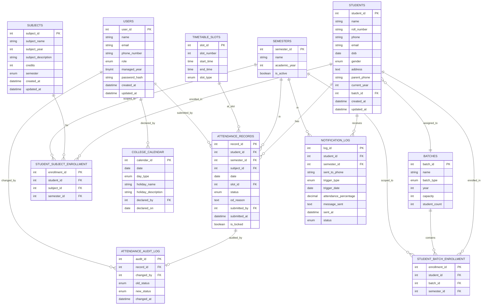

# Database Design
**Project**: Donbosco Attendance System | **Version**: 5.0 | **Date**: 2026-03-05

> Updated v5.0: Email login + `managed_year` added to users. `subject_id` added to attendance_records (staff picks at mark-time). `student_count` trigger on batches. `subjects.semester` is now ENUM('ODD','EVEN'). UNIQUE on attendance_records now includes `semester_id`. `sent_to_phone` snapshot added to notification_log. `slot_type` + 'OTHER'.

---

## 1. Entity-Relationship Diagram

---

## 2. Table Definitions

### 2.1 `users`
| Column | Type | Constraints |
|---|---|---|
| `user_id` | INT | PK, AUTO_INCREMENT |
| `name` | VARCHAR(100) | NOT NULL |
| `email` | VARCHAR(150) | NOT NULL, UNIQUE — **used for login** |
| `phone_number` | VARCHAR(15) | NOT NULL, UNIQUE — used for SMS |
| `role` | ENUM('PRINCIPAL','YEAR_COORDINATOR','SUBJECT_STAFF') | NOT NULL |
| `managed_year` | TINYINT | NULLABLE — 1–4 for YC; NULL for Principal & Staff |
| `password_hash` | VARCHAR(255) | NOT NULL |
| `created_at` | DATETIME | NOT NULL DEFAULT CURRENT_TIMESTAMP |
| `updated_at` | DATETIME | ON UPDATE CURRENT_TIMESTAMP |

> CHECK constraint enforces: YC must have `managed_year` 1–4; Principal and Staff must have NULL.

---

### 2.2 `students`
| Column | Type | Constraints |
|---|---|---|
| `student_id` | INT | PK, AUTO_INCREMENT |
| `name` | VARCHAR(100) | NOT NULL |
| `roll_number` | VARCHAR(20) | NOT NULL, UNIQUE |
| `phone` | VARCHAR(15) | NULLABLE (student's own phone) |
| `email` | VARCHAR(100) | NULLABLE |
| `dob` | DATE | NULLABLE |
| `gender` | ENUM('MALE','FEMALE','OTHER') | NULLABLE |
| `address` | TEXT | NULLABLE |
| `parent_phone` | VARCHAR(15) | NOT NULL |
| `current_year` | TINYINT | NOT NULL (1–4) |
| `batch_id` | INT | FK → batches |
| `created_at` | DATETIME | NOT NULL DEFAULT CURRENT_TIMESTAMP |
| `updated_at` | DATETIME | ON UPDATE CURRENT_TIMESTAMP |

---

### 2.3 `batches`
| Column | Type | Constraints |
|---|---|---|
| `batch_id` | INT | PK, AUTO_INCREMENT |
| `name` | VARCHAR(50) | NOT NULL |
| `batch_type` | ENUM('THEORY','LAB') | NOT NULL |
| `year` | TINYINT | NOT NULL (1–4) |
| `capacity` | INT | NOT NULL — max students |
| `student_count` | INT | NOT NULL DEFAULT 0 — **auto-updated by trigger** |

> `student_count` is auto-maintained: INSERT into `student_batch_enrollment` → +1; DELETE → -1.

---

### 2.4 `student_batch_enrollment`
| Column | Type | Constraints |
|---|---|---|
| `enrollment_id` | INT | PK, AUTO_INCREMENT |
| `student_id` | INT | FK → students |
| `batch_id` | INT | FK → batches |
| `semester_id` | INT | FK → semesters |

UNIQUE (`student_id`, `batch_id`, `semester_id`)

---

### 2.5 `subjects`
| Column | Type | Constraints |
|---|---|---|
| `subject_id` | INT | PK, AUTO_INCREMENT |
| `subject_name` | VARCHAR(100) | NOT NULL |
| `subject_year` | TINYINT | NOT NULL (1–4) |
| `subject_description` | TEXT | NULLABLE |
| `credits` | INT | NOT NULL |
| `semester` | ENUM('ODD','EVEN') | NOT NULL |
| `created_at` | DATETIME | NOT NULL DEFAULT CURRENT_TIMESTAMP |
| `updated_at` | DATETIME | ON UPDATE CURRENT_TIMESTAMP |

UNIQUE (`subject_name`, `subject_year`, `semester`) — prevents duplicate subjects.

> No `dept_id`. All subjects are college-wide.

---

### 2.6 `student_subject_enrollment`
| Column | Type | Constraints |
|---|---|---|
| `enrollment_id` | INT | PK, AUTO_INCREMENT |
| `student_id` | INT | FK → students |
| `subject_id` | INT | FK → subjects |
| `semester_id` | INT | FK → semesters |

UNIQUE (`student_id`, `subject_id`, `semester_id`)

---

### 2.7 `semesters`
| Column | Type | Constraints |
|---|---|---|
| `semester_id` | INT | PK, AUTO_INCREMENT |
| `name` | VARCHAR(50) | NOT NULL |
| `academic_year` | TINYINT | NOT NULL (1–4) — year of study, not semester number |
| `is_active` | BOOLEAN | NOT NULL DEFAULT FALSE |

> Only **one** semester should have `is_active = TRUE` at any time. App enforces this when activating a semester.

---

### 2.8 `timetable_slots`
| Column | Type | Constraints |
|---|---|---|
| `slot_id` | INT | PK, AUTO_INCREMENT |
| `slot_number` | TINYINT | NOT NULL (1–5) |
| `start_time` | TIME | NOT NULL |
| `end_time` | TIME | NOT NULL |
| `slot_type` | ENUM('THEORY','LAB','OTHER') | NOT NULL |

**Seed data:**
| # | Start | End | Type |
|---|---|---|---|
| 1 | 07:30 | 10:00 | LAB |
| 2 | 10:30 | 11:30 | THEORY |
| 3 | 11:30 | 12:30 | THEORY |
| 4 | 13:30 | 14:30 | THEORY |
| 5 | 14:45 | 17:15 | LAB |

---

### 2.9 `college_calendar`
| Column | Type | Constraints |
|---|---|---|
| `calendar_id` | INT | PK, AUTO_INCREMENT |
| `date` | DATE | NOT NULL, UNIQUE |
| `day_type` | ENUM('WORKING','HOLIDAY','SATURDAY_ENABLED') | NOT NULL |
| `holiday_name` | VARCHAR(100) | NULLABLE |
| `holiday_description` | TEXT | NULLABLE |
| `declared_by` | INT | FK → users (PRINCIPAL) |
| `declared_on` | DATE | NOT NULL |

---

### 2.10 `attendance_records`
| Column | Type | Constraints |
|---|---|---|
| `record_id` | INT | PK, AUTO_INCREMENT |
| `student_id` | INT | FK → students |
| `semester_id` | INT | FK → semesters |
| `subject_id` | INT | FK → subjects, **NULLABLE** — staff picks at mark-time |
| `date` | DATE | NOT NULL |
| `slot_id` | INT | FK → timetable_slots |
| `status` | ENUM('PRESENT','ABSENT','OD','INFORMED_LEAVE') | NOT NULL |
| `od_reason` | TEXT | NULLABLE |
| `submitted_by` | INT | FK → users |
| `submitted_at` | DATETIME | NOT NULL (server-set) |
| `is_locked` | BOOLEAN | NOT NULL DEFAULT FALSE |

UNIQUE (`student_id`, `date`, `slot_id`, `semester_id`) — includes semester_id to handle repeated years.

---

### 2.11 `attendance_audit_log`
| Column | Type | Constraints |
|---|---|---|
| `audit_id` | INT | PK, AUTO_INCREMENT |
| `record_id` | INT | FK → attendance_records |
| `changed_by` | INT | FK → users (PRINCIPAL) |
| `old_status` | ENUM('PRESENT','ABSENT','OD','INFORMED_LEAVE') | NOT NULL |
| `new_status` | ENUM('PRESENT','ABSENT','OD','INFORMED_LEAVE') | NOT NULL |
| `changed_at` | DATETIME | NOT NULL |

---

### 2.12 `notification_log`
| Column | Type | Constraints |
|---|---|---|
| `log_id` | INT | PK, AUTO_INCREMENT |
| `student_id` | INT | FK → students |
| `semester_id` | INT | FK → semesters |
| `sent_to_phone` | VARCHAR(15) | NOT NULL — snapshot of parent_phone at send time |
| `trigger_type` | ENUM('PER_PERIOD','MONTHLY_SUMMARY') | NOT NULL |
| `trigger_date` | DATE | NOT NULL |
| `attendance_percentage` | DECIMAL(5,2) | NULLABLE |
| `message_sent` | TEXT | NOT NULL |
| `sent_at` | DATETIME | NOT NULL |
| `status` | ENUM('SENT','FAILED') | NOT NULL |

> `DAILY_SUMMARY` trigger type removed.

## Links
- [[student database]]
- [[Architecture Design]]
- [[attendance Donbosco]]
