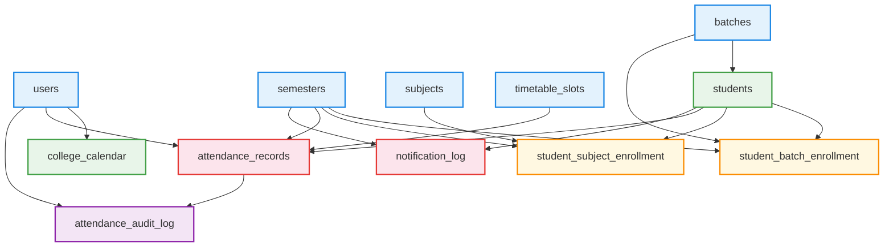

# Database Insertion Order
**Version**: v4.0 | **Updated**: 2026-03-05

> For a brand new installation. Run each step in order — skipping ahead will cause foreign key errors.

---

## Dependency Graph

---

## Step-by-Step Insertion Table

| Step   | Table                        | Who Does It                              | SQL File                               | Notes                                                                                              |
| ------ | ---------------------------- | ---------------------------------------- | -------------------------------------- | -------------------------------------------------------------------------------------------------- |
| **0**  | `timetable_slots`            | Schema (auto)                            | `SQL/01_schema.sql`                    | 5 slots pre-seeded automatically                                                                   |
| **1**  | `users` — Principal          | Schema (auto)                            | `SQL/01_schema.sql`                    | 1 Principal pre-seeded at deployment                                                               |
| **2**  | `batches`                    | Schema / Seed                            | `SQL/02_seed_test_data.sql`            | 24 fixed batches (6 per year × 4 years). Never entered by a user.                                  |
| **3**  | `semesters`                  | Principal                                | `SQL/crud/03_semesters_crud.sql`       | Create semesters for the current academic year. Set `is_active = TRUE` for current.                |
| **4**  | `subjects`                   | Principal                                | `SQL/principal/add_subject.sql`        | Add all subjects for the year before students arrive.                                              |
| **5**  | `users` — Staff & YC         | Principal                                | `SQL/crud/01_users_crud.sql`           | Add Year Co-ordinators and Subject Staff accounts.                                                 |
| **6**  | `college_calendar`           | Principal                                | `SQL/principal/declare_holiday.sql`    | Mark known holidays upfront (optional but recommended).                                            |
| **7**  | `students`                   | Year Co-ordinator                        | `SQL/year_coordinator/add_student.sql` | Add each student with batch assignment.                                                            |
| **8**  | `student_batch_enrollment`   | YC (Step 2 of add_student)               | `SQL/year_coordinator/add_student.sql` | Auto-runs after student insert. Links student ↔ batch ↔ semester.                                  |
| **9**  | `student_subject_enrollment` | YC (Step 3 of add_student)               | `SQL/year_coordinator/add_student.sql` | Auto-enrolls student in all regular subjects for their year+semester. Electives/ELM done manually. |
| **10** | `attendance_records`         | Subject Staff                            | `SQL/staff/submit_attendance.sql`      | Day-to-day operation. Requires Steps 1–9 to be complete.                                           |
| **11** | `notification_log`           | System (auto)                            | Application layer                      | Inserted automatically after each SMS trigger.                                                     |
| **12** | `attendance_audit_log`       | System (auto after Principal correction) | `SQL/principal/insert_audit_log.sql`   | Inserted right after Principal uses `correct_attendance.sql`.                                      |
|        |                              |                                          |                                        |                                                                                                    |

---

## Deployment vs Day-to-Day

| Phase | Steps | Who |
|-------|-------|-----|
| **Deployment** (once ever) | 0, 1, 2 | Schema auto |
| **Semester Setup** (each new semester) | 3, 4, 5, 6 | Principal |
| **Student Onboarding** (start of semester) | 7, 8, 9 | Year Co-ordinator |
| **Daily Operations** | 10, 11, 12 | Staff / System |

---

## Quick Rules

- **Never skip a level** — inserting an `attendance_record` before the `student` exists will fail with a FK error.
- **Batches and timetable slots are fixed** — they are seeded once and never re-entered.
- **Only one semester should have `is_active = TRUE`** at a time. Set it in Step 3.
- **Elective (3rd yr) and ELM (4th yr)** subject enrollments must be done manually by YC after Step 9.

## Links
- [[Database Design]]
- [[Architecture Design]]
- [[attendance Donbosco]]
