# System Design
**Project**: Donbosco Attendance System | **Version**: 5.0 (Node.js) | **Date**: 2026-03-05

> Reflects latest changes: no daily SMS, simplified Users, restructured Subjects. Backend migrated to Node.js + Express.js.

---

## 1. Roles and Their Scope

```mermaid
graph TD
    SYS["🏫 Donbosco Attendance System"]
    SYS --> P["👨‍💼 Principal\n(1 account — pre-seeded)"]
    SYS --> YC["📋 Year Co-ordinator\n(1 per year × 4 = 4 accounts)"]
    SYS --> SS["👨‍🏫 Subject Staff\n(No pre-assignment)"]

    P --> P1["Dashboard — college-wide graphs"]
    P --> P2["Add Staff (name, phone, role)"]
    P --> P3["Add Subject (name, year, credits, semester)"]
    P --> P4["Holiday Marking (calendar + name + desc)"]
    P --> P5["Attendance Correction\n(any date — can set Present/Absent/OD/IL)"]
    P --> P6["Attendance View (all years)"]
    P --> P7["Audit Log"]

    YC --> YC1["Dashboard — year graphs + stats"]
    YC --> YC2["Add Students (details + batch no)"]
    YC --> YC3["Map subjects + enroll students"]
    YC --> YC4["Pre-enter OD/IL (future days only)"]
    YC --> YC5["Multi-view attendance + % report"]

    SS --> SS1["Year → Batch → Period → Fetch → Mark"]
    SS --> SS2["Submit within 20 min"]
```

---

## 2. Batch Structure

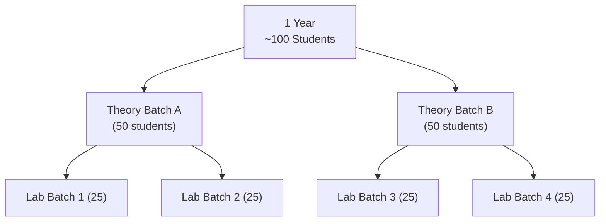

---

## 3. Event: Staff Takes Attendance

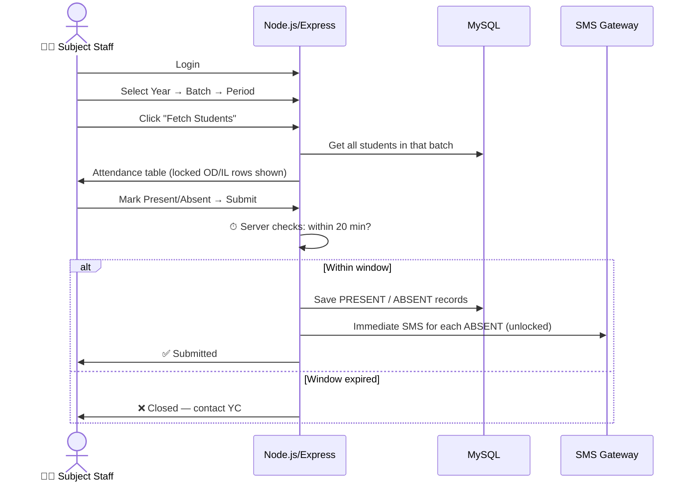

---

## 4. Event: YC Pre-enters OD / Informed Leave

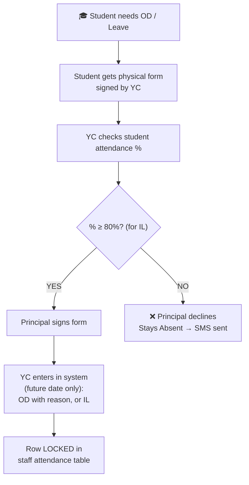

---

## 5. Event: Principal Corrects Attendance

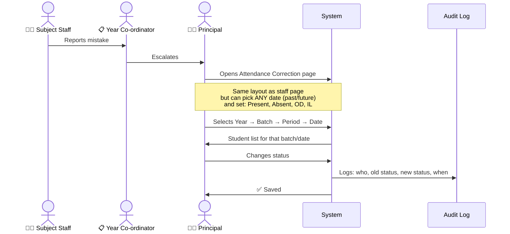

---

## 6. Event: Principal Marks Holiday

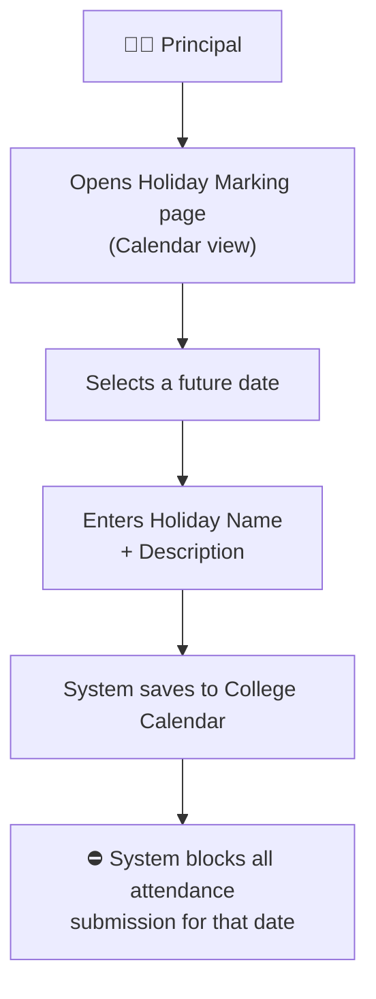

---

## 7. Event: SMS Notification Flow

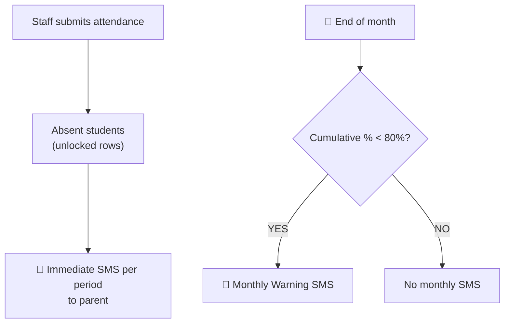

> ❌ Daily Summary SMS removed.

---

## 8. Event: Attendance % Calculation

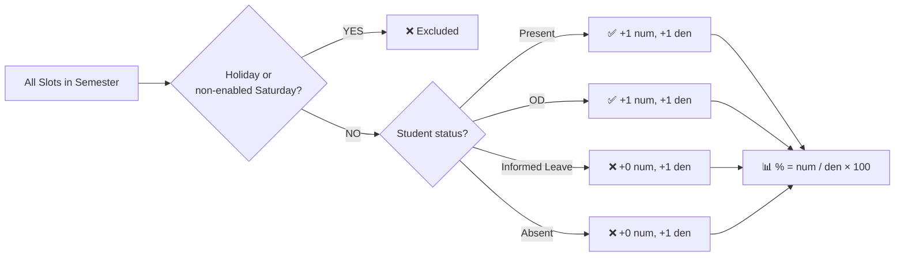

---

## 9. Event: Semester Setup (future feature)

> This setup flow can be added in later iterations.

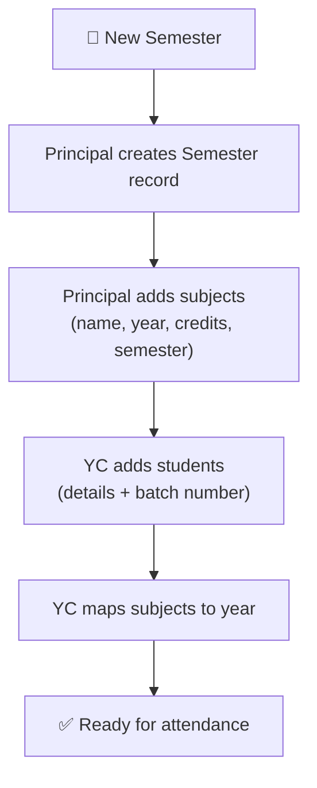

---

## 10. YC Multi-View Attendance

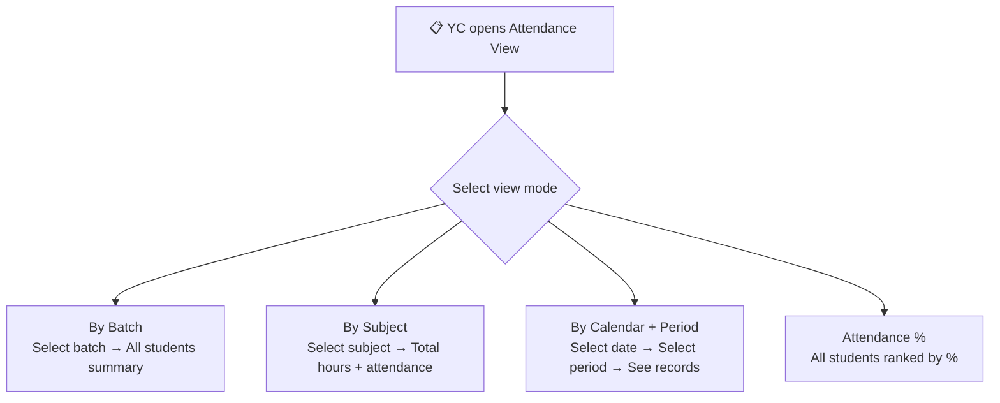

---

## 11. Database Summary (Entity Map)

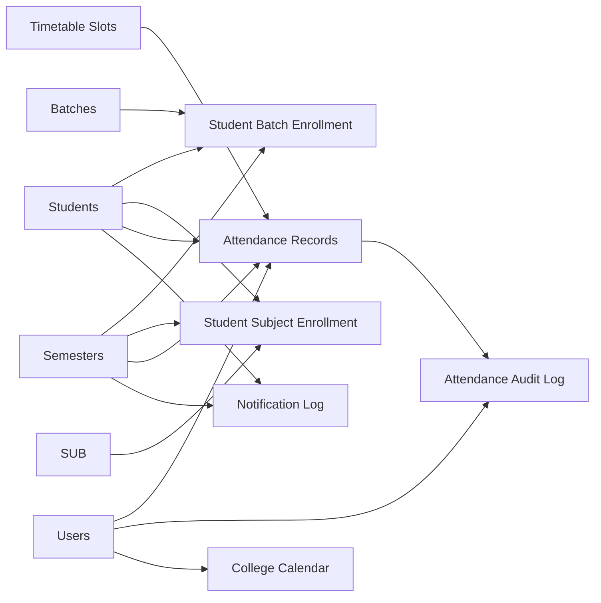

## Links
- [[attendance Donbosco]]
- [[BRS]]
- [[SRS]]
- [[Database Design]]
- [[Architecture Design]]
- [[Backend Architecture]]
- [[API Reference]]
