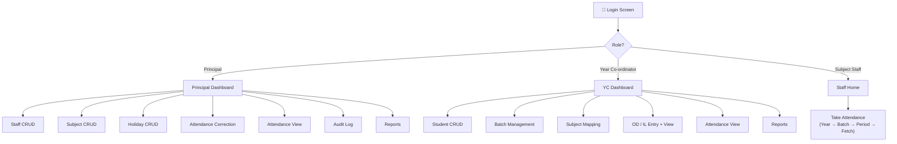

# UI Design
**Project**: Donbosco Attendance System | **Version**: 2.1 | **Date**: 2026-03-06

> Updated (06-03-26): CRUD screens added for student/staff/subject/attendance/holiday; attendance view batch column removed; attendance correction changed to 5-period columns; OD leave read+update added; theme defined; date selecting and sidebar issues noted.

---

## Theme

| Property | Value |
|---|---|
| **Colors** | Dark blue, green, white |
| **Table style** | Similar to Google Sheets — grid lines, alternating row shading |
| **Header bar (left → center)** | "Attendance Management System" + college logo |
| **Header bar (top right)** | "Welcome, \<Name\>" for every role |
| **Text color** | Black |
| **Overall aesthetic** | Professional and classic — like Microsoft Excel, **not** glossy |

---

## 1. Navigation Map

---

## 2. Screen: Login

**Visible to**: All users

| Element | Details |
|---|---|
| College logo + name | Top center |
| Email field | Text input (email address) |
| Password field | Password input (masked) |
| Login button | Primary CTA |
| Forgot Password link | OTP reset flow |
| Error message | "Invalid credentials" (generic) |

> ⚠️ **Known Issue (06-03-26)**: Date selecting problem to be fixed — ensure date pickers use a consistent, future-only-capable calendar component across all screens.

### Forgot Password Flow
1. Enter registered phone number → OTP sent → Enter OTP → Set new password → Redirect to login.

---

## 3. Screen: Principal Dashboard (Homepage)

**Visible to**: Principal only

| Section | Content |
|---|---|
| **Attendance Graphs** | College-wide %, per-year %, per-batch %, trend chart |
| **Key Stats Cards** | Total students, # below 80%, recent corrections count |
| **Sidebar** | Staff CRUD, Subject CRUD, Holiday CRUD, Attendance Correction, Attendance View, Audit Log, Reports |
| **Recent Audit Entries** | Last 5 manual changes |

> ⚠️ **Known Issue (06-03-26)**: Sidebar blackout bug — sidebar must remain visible and not go dark/disappear on navigation.

---

## 4. Screen: Principal — Staff CRUD

### Staff List (Read)
| Column | Details |
|---|---|
| Name | Text |
| Email | Text |
| Phone | Text |
| Role | Year Co-ordinator / Subject Staff |
| Actions | Edit ✏️ / Deactivate 🗑️ |

these tables should be blow the add staff form
witht he folowing columns
### Add / Edit Staff Form
| Element | Details |
|---|---|
| Staff Name | Text input |
| Email | Text input |
| Phone Number | Text input |
| Role | Dropdown: Year Co-ordinator / Subject Staff |
| Save button | Creates account with default password (on Add) |

---

## 5. Screen: Principal — Subject CRUD

### Subject List (Read)
| Column | Details |
|---|---|
| Subject Name | Text |
| Subject Code | Text |
| Year | 1st–4th |
| Semester | Odd / Even |
| Credits | Number |
| Actions | Edit ✏️ / Delete 🗑️ |

same as the staff 
### Add / Edit Subject Form
| Element | Details |
|---|---|
| Subject Name | Text input |
| Subject Code | Text input |
| Year | Dropdown: 1st / 2nd / 3rd / 4th |
| Description | Text area |
| Credits | Number input |
| Semester | Dropdown: Odd / Even |
| Save button | Creates / updates subject globally |

---

## 6. Screen: Principal — Holiday CRUD

| Element | Details |
|---|---|
| **Calendar View** | Monthly calendar, colour-coded (Working = white, Holiday = red, Saturday enabled = green) |
| Select a date | Click on any **future** date |
| Holiday Name | Text input (e.g., "Republic Day") |
| Holiday Description | Text area (e.g., "National Holiday") |
| Mark Holiday button | Saves to College Calendar, blocks attendance for that day |
| Enable Saturday button | For Saturdays only — marks as working day |
| Edit Holiday | Click existing holiday → edit name/description → Save |
| Delete Holiday | Click existing holiday → Delete button (future dates only) |
| Cannot modify past dates | Past dates greyed out |

---

## 7. Screen: Principal — Attendance Correction

**Same layout as the staff attendance page**, with extra powers:

| Element | Details |
|---|---|
| Year selector | 1st / 2nd / 3rd / 4th |
| **Date picker** | Can select **any date — past or future** |
| Fetch Students button | Returns all students in that year for that date |
| **Attendance Table** | Rows = Students; Columns = Period 1, Period 2, Period 3, Period 4, Period 5 |
| Cell value | Present / Absent / OD / Informed Leave (editable dropdown per cell) |
| OD Reason | Shown inline when OD selected |
| Save button | Saves all changes + triggers Audit Log entries |

> **Note**: Batch selector removed. All students in the selected year are shown. The 5 periods appear as columns, not rows.

---

## 8. Screen: Principal — Attendance View

| Element | Details |
|---|---|
| Year selector | 1st / 2nd / 3rd / 4th (or All) |
| Date range picker | From / To |
| **Attendance Table** | Rows = Students; Columns = Period 1–5 per day |
| Attendance % | Shown per student as final column |

> Batch column removed from this view. Year-wise data is the primary grouping.

---

## 9. Screen: Principal — Audit Log

| Column | Details |
|---|---|
| Timestamp | Date and time of change |
| Student | Name + Roll No |
| Date (of period) | Which date was changed |
| Period | Which slot |
| Old Status | Previous value |
| New Status | New value |
| Changed By | Always "Principal" |

- Filter by date range
- Read-only, no undo

---

## 10. Screen: YC Dashboard (Homepage)

**Visible to**: Year Co-ordinator (their year only)

| Section | Content |
|---|---|
| **Attendance Graphs** | Year-wide %, trend chart |
| **Key Stats Cards** | Total students in year, # below 80%, pending OD/IL entries |
| **Sidebar** | Student CRUD, OD / IL Entry + View, Attendance View, Reports |

---

## 11. Screen: YC — Student CRUD

### Student List (Read)
| Column | Details |
|---|---|
| Roll Number | Text |
| Name | Text |
| Batch | Assigned batch |
| Parent Phone | Text |
| Actions | Edit ✏️ / Remove 🗑️ |

### Add / Edit Student Form
| Element | Details |
|---|---|
| Student Name | Text input |
| Roll Number | Text input |
| Parent Phone | Text input |
| **Batch Number** | Dropdown — assign batch immediately |
| Save button | Adds / updates student in the year |

Also supports bulk upload via CSV/file.

---

## 12. Screen: YC — OD / Informed Leave Entry + View

### Entry (Create)
| Element | Details |
|---|---|
| Student search | Search by name or roll number (within YC's year) |
| Student card | Shows current attendance % prominently |
| % Indicator | 🟢 ≥ 80% (can proceed) / 🔴 < 80% (Principal will not sign IL) |
| Leave type | Dropdown: OD / Informed Leave |
| OD Reason | Text — required if OD |
| **Date selector** | **Future dates only** |
| Period selector | Which slot(s) |
| Submit button | Locks the row for that student in the staff's table |

### View (Read + Update)
| Column | Details |
|---|---|
| Student | Name + Roll No |
| Date | Leave date |
| Period | Slot number |
| Type | OD / Informed Leave |
| Reason | OD reason text |
| Actions | Edit ✏️ (reason/date, future only) / Cancel 🗑️ |

- **Edit**: YC can update the OD reason or date (future dates only, before staff submission)
- **Cancel**: Removes the OD/IL lock — row becomes editable again for staff

---

## 13. Screen: YC — Attendance View

| Element | Details |
|---|---|
| Year | Fixed to YC's assigned year |
| Date range picker | From / To |
| **Attendance Table** | Rows = Students; Columns = Period 1–5 per day |
| Attendance % | Shown per student as final column |

> Batch column removed. Year-wide view; student list shows all students in the year.

---

## 14. Screen: Staff — Take Attendance

**Visible to**: Subject Staff

### Navigation Flow
| Step | UI Element |
|---|---|
| Step 1 | Year selector (radio: 1st / 2nd / 3rd / 4th) |
| Step 2 | Batch selector (all batches — no pre-assignment filtering) |
| Step 3 | Period selector (1–5) |
| Step 4 | **"Fetch Students" button** |
| Step 5 | Attendance table appears |

### Attendance Table
| Column | Type | Notes |
|---|---|---|
| Roll No | Text | Read-only |
| Name | Text | Read-only |
| Status | Toggle: Present ✅ / Absent ❌ | Editable only if unlocked |
| Remarks | Text | Read-only (OD reason, IL note, or blank) |
| Lock icon 🔒 | Icon | Shown on locked OD/IL rows |

- **Timer bar**: remaining minutes in the 20-min window
- **Submit button**: disabled after window expires

### Post-Submission Screen
- Summary: X Present, Y Absent (→ UL), Z Locked (OD/IL)
- ✅ Confirmation — cannot re-open

---

## 15. Screen: Semester Management

**Visible to**: Principal

> **Who updates the semester?** The Principal activates a new semester manually. This is done at the start of each academic term. Activating a semester deactivates the current active one.

| Element | Details |
|---|---|
| Semester list | Shows all semesters (year + Odd/Even + status: Active/Inactive) |
| Activate button | Sets selected semester as active (only one active at a time) |

---

## 16. Screen: Reports (Principal & YC)

| Filter | Options |
|---|---|
| By Year | 1st / 2nd / 3rd / 4th (Principal: all; YC: own year) |
| By Date Range | Date picker |
| By Semester | Semester selector |
| By Status | All / Below 80% / Above 80% |

Export: PDF / Excel

---

## Links
- [[attendance Donbosco]]
- [[SRS]]
- [[Architecture Design]]
- [[API Reference]]
