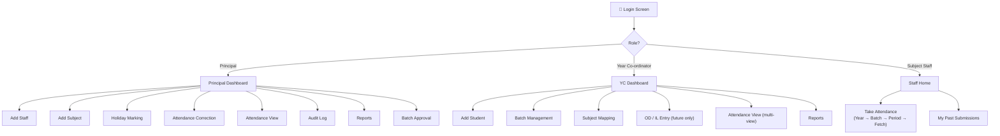

   # UI Design
**Project**: Donbosco Attendance System | **Version**: 2.0 (Updated) | **Date**: 2026-03-03

> Updated to reflect: no subject-staff mapping, dashboards for YC and Principal, multi-view attendance, holiday with name+desc.

---

## 1. Navigation Map

---

## 2. Screen: Login

**Visible to**: All users

| Element | Details |
|---|---|
| College logo + name | Top center |
| Username field | Text input |
| Password field | Password input (masked) |
| Login button | Primary CTA |
| Forgot Password link | OTP reset flow |
| Error message | "Invalid credentials" (generic) |

### Forgot Password Flow
1. Enter registered phone number → OTP sent → Enter OTP → Set new password → Redirect to login.

---

## 3. Screen: Principal Dashboard (Homepage)

**Visible to**: Principal only

| Section | Content |
|---|---|
| **Attendance Graphs** | College-wide %, per-year %, per-batch %, trend chart |
| **Key Stats Cards** | Total students, # below 80%, recent corrections count |
| **Quick Actions** | Add Staff, Add Subject, Holiday Marking, Attendance Correction |
| **Recent Audit Entries** | Last 5 manual changes |

---

## 4. Screen: Principal — Add Staff

| Element | Details |
|---|---|
| Staff Name | Text input |
| Phone Number | Text input |
| Role | Dropdown: Year Co-ordinator / Subject Staff |
| Save button | Creates account with default password |

---

## 5. Screen: Principal — Add Subject

| Element | Details |
|---|---|
| Subject Name | Text input |
| Year | Dropdown: 1st / 2nd / 3rd / 4th |
| Description | Text area |
| Credits | Number input |
| Semester | Dropdown: Odd / Even |
| Save button | Creates subject globally |

---

## 6. Screen: Principal — Holiday Marking

| Element | Details |
|---|---|
| **Calendar View** | Monthly calendar, colour-coded (Working = white, Holiday = red, Saturday enabled = green) |
| Select a date | Click on any **future** date |
| Holiday Name | Text input (e.g., "Republic Day") |
| Holiday Description | Text area (e.g., "National Holiday") |
| Mark Holiday button | Saves to College Calendar, blocks attendance for that day |
| Enable Saturday button | For Saturdays only — marks as working day |
| Cannot modify past dates | Past dates greyed out |

---

## 7. Screen: Principal — Attendance Correction

**Same layout as the staff attendance page**, with extra powers:

| Element | Details |
|---|---|
| Year selector | 1st / 2nd / 3rd / 4th |
| Batch selector | All batches for that year |
| Period selector | 1–5 |
| **Date picker** | Can select **any date — past or future** |
| Fetch Students button | Returns all students in that batch |
| Attendance table | Same columns as staff table, but **all rows editable** |
| Status dropdown per row | Present / Absent / OD / Informed Leave |
| OD Reason field | Text — shown when OD selected |
| Save button | Saves changes + triggers Audit Log entries |

---

## 8. Screen: Principal — Attendance View

Same multi-view as YC (see below) but for the **entire college**, not just one year.

---

## 9. Screen: Principal — Audit Log

| Column | Details |
|---|---|
| Timestamp | Date and time of change |
| Student | Name + Roll No |
| Date (of period) | Which date was changed |
| Period | Which slot |
| Old Status | Previous value |
| New Status | New value |
| Changed By | Always "Principal" |

- Filter by date range
- Shows what the Principal has saved — read-only, no undo

---

## 10. Screen: YC Dashboard (Homepage)

**Visible to**: Year Co-ordinator (their year only)

| Section | Content |
|---|---|
| **Attendance Graphs** | Year-wide %, per-batch %, trend chart |
| **Key Stats Cards** | Total students in year, # below 80%, pending OD/IL entries |
| **Quick Actions** | Add Student, Enter OD/Leave, View Attendance |
| **Batch Overview** | Batch A, B (theory), Batch 1–4 (lab) with student counts |

---

## 11. Screen: YC — Add Student

| Element | Details |
|---|---|
| Student Name | Text input |
| Roll Number | Text input |
| Parent Phone | Text input |
| **Batch Number** | Dropdown — assign the student to a batch immediately |
| Save button | Adds student to the year |

Also supports bulk upload via CSV/file.

---

## 12. Screen: YC — OD / Informed Leave Entry

| Element | Details |
|---|---|
| Student search | Search by name or roll number (within YC's year) |
| Student card | Shows current attendance % prominently |
| % Indicator | 🟢 ≥ 80% (can proceed) / 🔴 < 80% (Principal will not sign IL) |
| Leave type | Dropdown: OD / Informed Leave |
| OD Reason | Text — required if OD |
| **Date selector** | **Future dates only** |
| Period selector | Which slot(s) |
| Submit button | Locks the row for that student in the staff's table |

---

## 13. Screen: YC — Attendance View (Multi-View)

| View Tab | How it works |
|---|---|
| **By Batch** | Select batch → See all students + attendance summary |
| **By Subject** | Select subject → See total hours + per-student attendance |
| **By Calendar + Period** | Select date from calendar → Select period → See who was present/absent |
| **Attendance %** | All students in the year ranked by attendance % |

> Each view shows the attendance percentage as the key metric.

---

## 14. Screen: Staff — Take Attendance

**Visible to**: Subject Staff

### Navigation Flow
| Step | UI Element |
|---|---|
| Step 1 | Year selector (radio: 1st / 2nd / 3rd / 4th) |
| Step 2 | Batch selector (all batches — no pre-assignment filtering) |
| Step 3 | Period selector (1–5) |
| Step 4 | **"Fetch Students" button** |
| Step 5 | Attendance table appears |

### Attendance Table
| Column | Type | Notes |
|---|---|---|
| Roll No | Text | Read-only |
| Name | Text | Read-only |
| Status | Toggle: Present ✅ / Absent ❌ | Editable only if unlocked |
| Remarks | Text | Read-only (OD reason, IL note, or blank) |
| Lock icon 🔒 | Icon | Shown on locked OD/IL rows |

- **Timer bar**: remaining minutes in the 20-min window
- **Submit button**: disabled after window expires

### Post-Submission Screen
- Summary: X Present, Y Absent (→ UL), Z Locked (OD/IL)
- ✅ Confirmation — cannot re-open

---

## 15. Screen: Reports (Principal & YC)

| Filter | Options |
|---|---|
| By Year | 1st / 2nd / 3rd / 4th (Principal: all; YC: own year) |
| By Batch | All / Batch A / Batch B / Batch 1–4 |
| By Subject | Subject dropdown |
| By Date Range | Date picker |
| By Semester | Semester selector |
| By Status | All / Below 80% / Above 80% |

Export: PDF / Excel

## Links
- [[attendance Donbosco]]
- [[SRS]]
- [[Architecture Design]]
